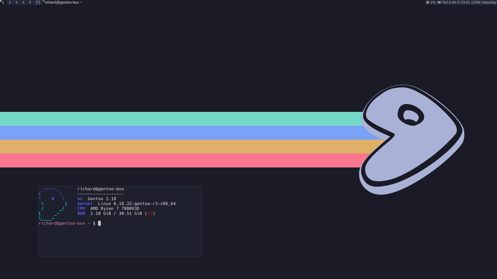

# Tokyo Night Themed dwm

This is a Tokyo-Night Themed dwm

dwm is an extremely fast, small, and dynamic window manager for X.




## Features

+ Tokyo Night colorscheme
+ Minimal dwm (Uses about 200mb on idle)
+ Custom bash prompt
+ Centered dmenu
+ Nerd Font icons in the bar


## Installation

### Requirements

+ A Linux (or Linux-like) system — this is written for a Unix-style environment; won't run as-is on Windows without WSL

+ Root/sudo access — the script calls sudo make install four times, so the user running it needs sudo privileges (or be root)

+ An X11 display server available or installable — dwm/slstatus/st/dmenu are X11 window manager/statusbar/terminal/launcher, useless without X11 present (not needed at script run time necessarily, but needed at use time)

+ Internet access — needed for the wget call to fetch the Nerd Font zip from GitHub

+ A home directory with write permissions — script writes to ~/.xinitrc, ~/.bashrc, ~/.local/share/fonts

### Dependencies

+ xorg-server

+ xorg-xinit

+ libx11

+ libxinerama

+ libxft

+ unzip

+ wget

+ make 

+ gcc

+ bash

### Cloning the repo

Using git in terminal:

```git clone https://github.com/mel0nze/dwm-tokyo-night.git```

Clicking *<>Code* then *Download ZIP* on the github page.


### Running the install script 

Make it executable:

```chmod +x ./install.sh```

Then run it with:

```./install.sh```


## Usage 

The script writes a simple xinit configuration in ~/.xinitrc , and can be started with:

``` startx ```


## Customization 

The configuration of the rice is done by editing the  config.h for each program and (re)compiling the source code.

This can be done manually from the program source directory with:

```sudo make install```

Or by running the custom recompile script included, from the project root directory:

```./recompile```  

**Make sure its executable with:**

```chmod +x ./recompile```


## Uninstall

Make it executable:

```chmod +x ./uninstall.sh```

And run it:

```./uninstall.sh```


## Support me!

Give this project a star to show your support!


